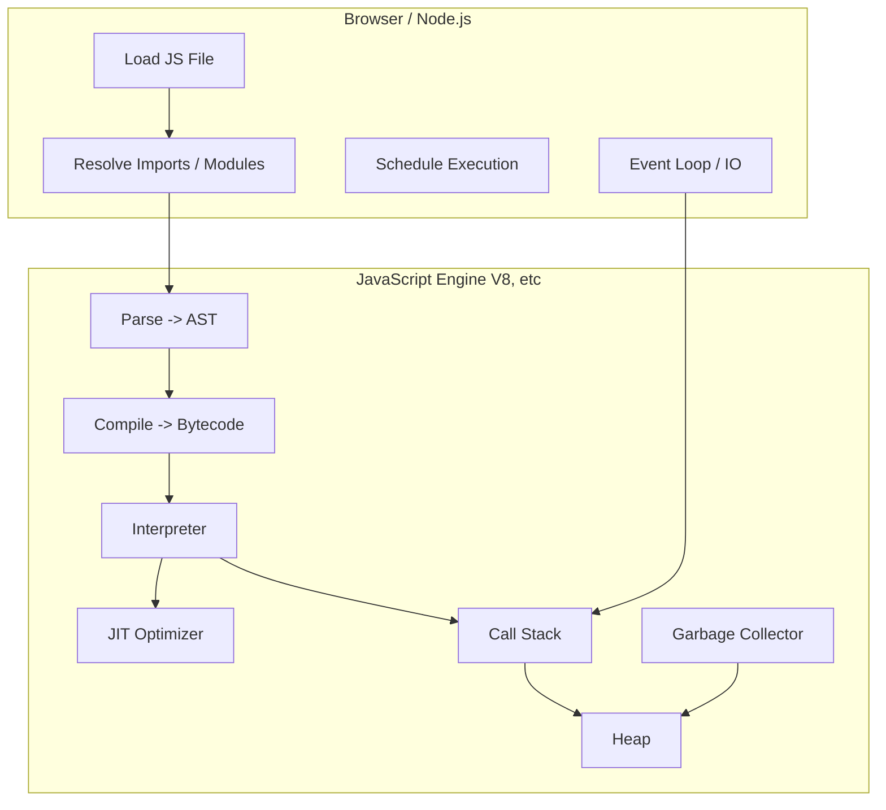
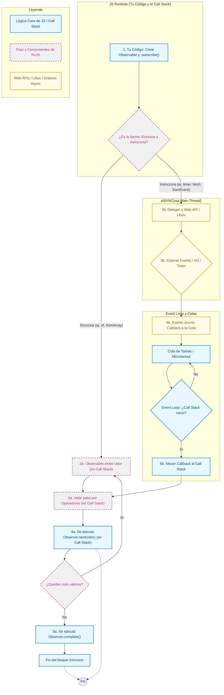
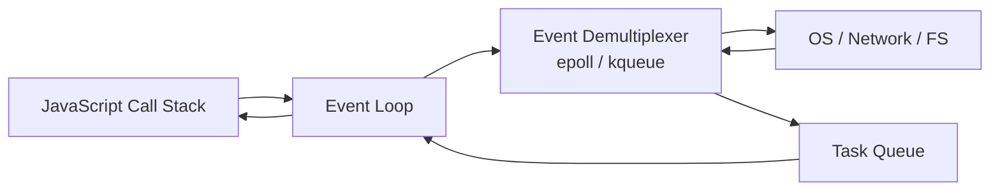

LibUV: C++ lib eneble event driven Arch

process and a thread

a process is a simple running program. Every app you open whether it is a browser, a text editor or a server is a process. Inside a process, we have threads which are resposible executing task.  

So what is the difference? 

A process has its own memory space and resources. A thread is a smaller unit inside a process that actually executes the code. Threads share memory within the same process

Example: 
A restaurant is a process has all resources (kitchen, menu, tables, waiters), while waiters (threads) handle customer orders.

In multi-threaded systems multiple threads can handle concurrently allowing task to execute in parallel. but in a single threaded model only thread code execute code at a time. Imadine a kitchen with only one cheff a single  thread. Now if the chef is chopping vegetables, they cannot stir a soup or bake a cake at the same time. Similarly in a single thread environment, the program must finish one task before moving to the next. think of a process as a restaurant and threads as waiters

The restaurant or process has all the resources (kitchen, tables menu) while waiters (threads) handle orders bringing food to ordes. 


Since, there is only one thread javascript uses **call stack** to keep track of function execution. so when a function is called  is added to the stack, when the function returns is remove from the stack.

for example:

```js
fuction a(){
    console.log('A');
}

fuction b(){
    a();
    console.log('B');
}
b();
```
for example, here loop blocks the thread delaying execution of **console.log('End')**. One major challenge with single-threaded models is handling long-running tasks without freezing the entire application.

```js
console.log('Start');   
for(let i=0; i<1e9; i++){} // Blocking loop 
console.log('End');
```

Imagine a system handling multiple user request when suddenly a complex calculation is needed. In a single-threaded model, this calculation would block all other requests until it completes, leading to poor user experience.
To mitigate this, JavaScript environments like Node.js use an event-driven architecture with an event loop and callback queue to handle asynchronous operations efficiently.
Lack of parallelism: Single-threaded models cannot take full advantage of multi-core processors, limiting performance for CPU-intensive tasks.

To overcome these issue, traditional web server like apache use a multi-threaded model where each incoming request gets its own thread. This ensures that a slow request doesn't block others. 
However, this approach can be resource-intensive as each thread consumes memory and CPU time.

## Nodejs approach

Instead of create a new thread for each request, Node.js uses a single-threaded, but uses an event-driven non-blocking IO model. 
This allows it to handle many connections concurrently without getting stuck waiting for slow task.

When a request comes in that requires I/O (like reading from a database or file system), Node.js offloads that operation 
to the system kernel or a thread pool managed by libuv. While waiting for the I/O operation to complete, 
the event loop continues to process other incoming requests. Once the I/O operation is done, 
a callback is placed in the event queue to be executed when the event loop is ready.







